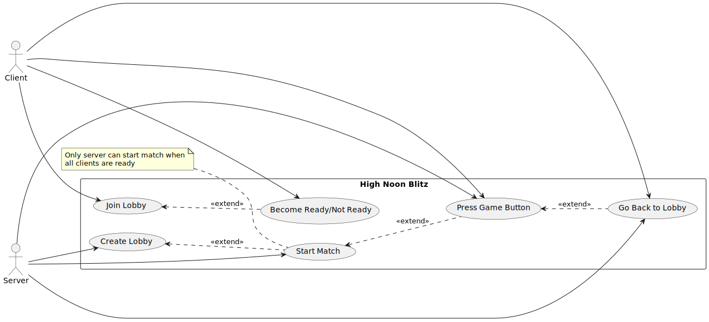
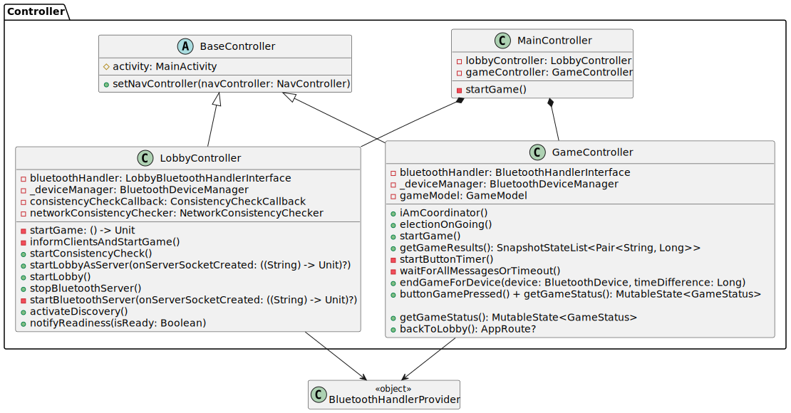
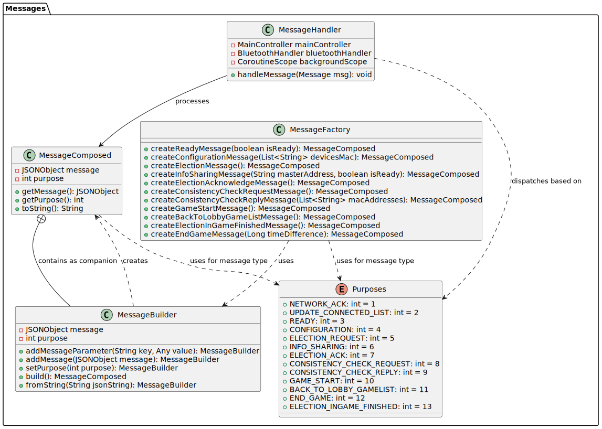
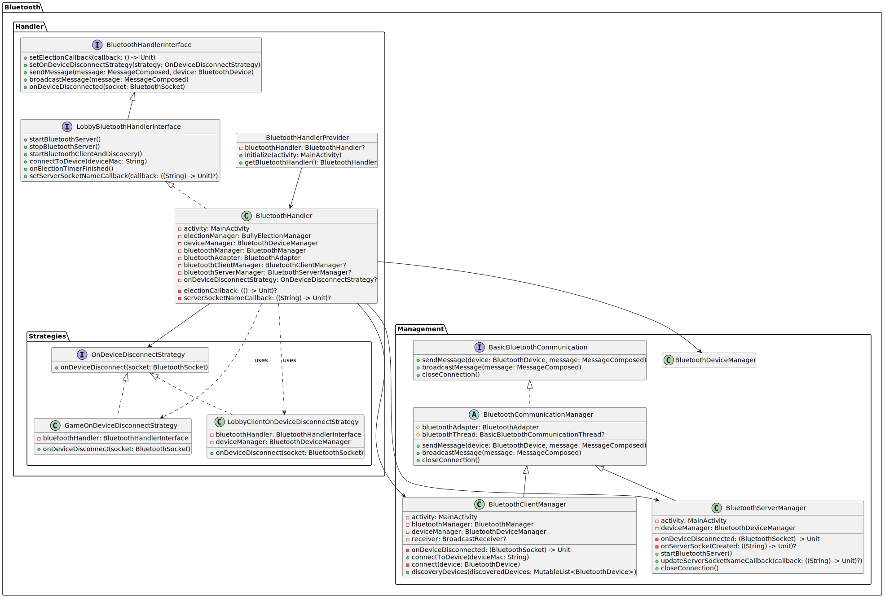
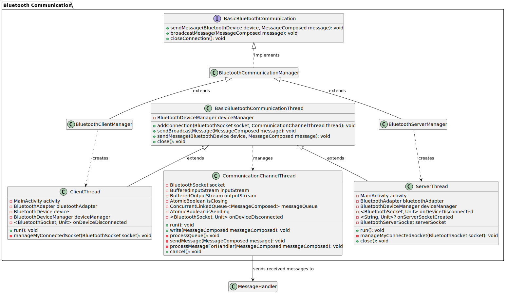
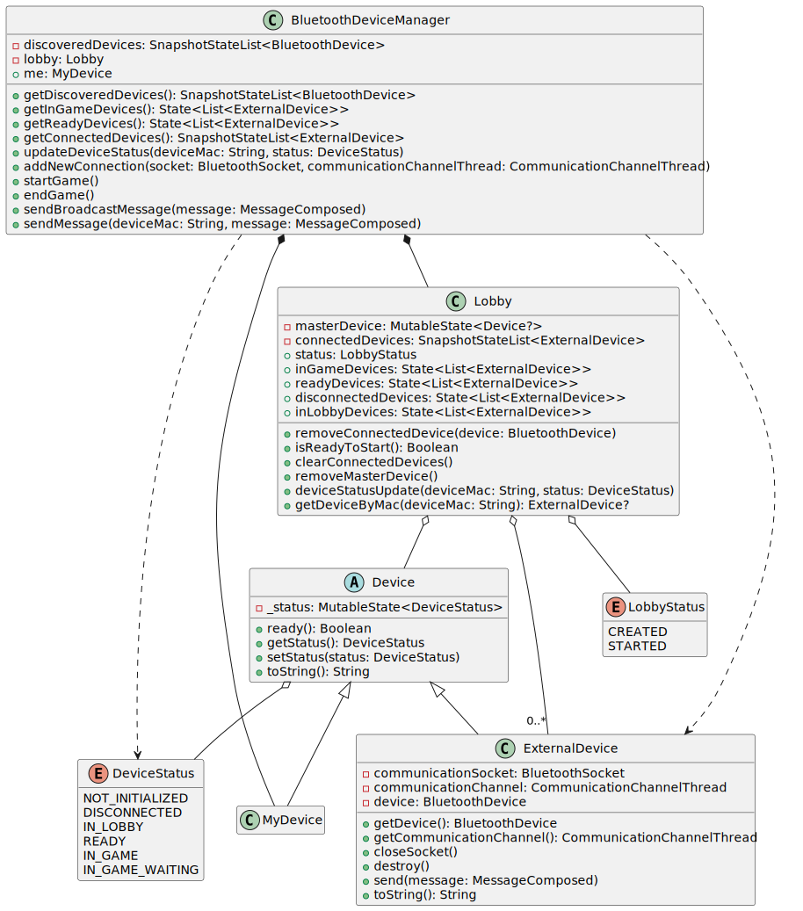
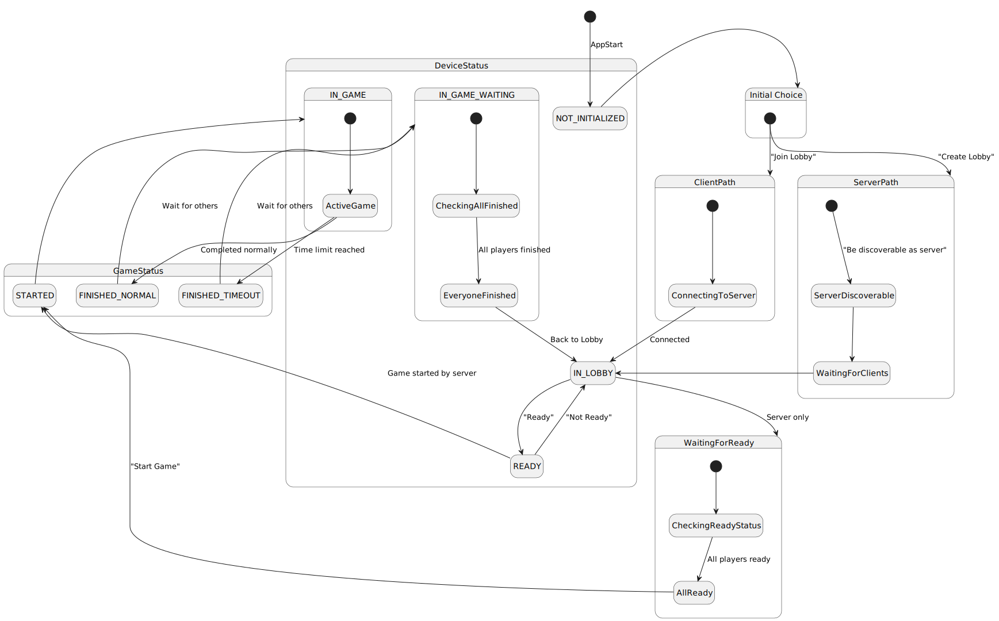

# HNB Final Report Template

[Alessandro Becci](mailto:alessandro.becci@studio.unibo.it), [Luca Tonelli](mailto:luca.tonelli11@studio.unibo.it)

### Abstract

The project aims to build a peer-to-peer Android game using the Bluetooth communication protocol.
The objective is to implement a reaction-based game where the players have to react faster than each
other to a specific random signal, miming a “high noon dual”. Any node of the network (a phone) will
be able to create or participate in a match.

At the start of the application, users can choose to become either a server or a client. The server has the ability to create a lobby, while the client can join an existing one. Once all players are ready, the server will be able to initiate the match. During game, the players will see a button appear on their screens, and they must press it as quickly as possible. The first player to press the button wins the match. The button will appear at random times and positions on the screen, adding an element of surprise and challenge.

After all the players have finished the game, they will be able to see the leaderboard with reaction times.
Once the game is over, the players can return to the lobby.

## Goal/Requirements

The project aims to develop a game that utilizes Bluetooth communication protocol. 
A key initial step is to evaluate whether Bluetooth possesses the necessary capabilities to support
the game's requirements. To assess this need, developing a prototype for assessing it is essential.

A significant technical challenge involves also designing a strategy that can accurately measure players
reaction times accounting for Bluetooth latency.

Additionally, the project must incorporate 
robust fault tolerance mechanisms to enhance reliability, specifically addressing scenarios such 
as connection interruptions or players exiting mid-game.

We expect that the application will offer various features, related to lobby and game phases.

<figure>
  
  <figcaption>Figure 1. Use Cases Diagram showing the main use cases of the system.</figcaption>
</figure>

### Scenarios

Users interact with the application when they want to play a round of the game. Upon opening the application, they can choose between two roles:

**Server Role:** The user can make their phone discoverable via Bluetooth connection, creating a lobby that others can join.

**Client Role:** The user can scan for discoverable phones in the area and connect to them to join an existing lobby. While clients typically connect to servers, they can also connect to other clients, in which case server information is shared across all connected phones.

Once connected, clients can indicate their readiness to the network. The server can initiate the match only when all connected clients have marked themselves as ready.

During gameplay, all users must react to the HNB Button that appears in a random location on their screens and at random times. After all players have clicked the button, a leaderboard displays the results.

Following a match, players can return to the lobby for another game or disconnect to join different players.

The system accounts for potential connection loss between phones during any phase of the game, ensuring appropriate handling of these scenarios.

Informal description of the ways users are expected to interact with your project.
It should describe _how_ and _why_ a user should use / interact with the system.

### Self-assessment policy

The quality of the produced software will be assessed through a multi-dimensional evaluation approach:

1. **User Acceptance Testing**: We will conduct structured testing sessions with two distinct user groups:
  - Participants familiar with the game mechanics to evaluate advanced functionality
  - First-time users to assess intuitiveness and learning curve

2. **Cross-device Compatibility**: The application will be tested across multiple Android devices spanning different:
  - Screen sizes and resolutions
  - Hardware specifications
  - Android OS versions (from 12.0 to latest)

3. **Network Resilience Testing**: We will simulate various connection scenarios to evaluate robustness:
  - Intentional disconnections at critical points in the gameplay loop
  - Testing failure scenarios for both server and client roles
  - Observing effects on gameplay experience

4. **Performance Evaluation**: While exact measurements are not feasible, these key performance aspects will be qualitatively evaluated:
  - Application responsiveness 
  - Bluetooth connection stability
  - Effectiveness of reaction time calculation approach

## Requirements Analysis

### Implicit Requirements

1.  **Synchronization Mechanism**: There's an implicit need for time synchronization between devices to ensure fair gameplay and accurate reaction time comparison.
2.  **User Interface Adaptability**: The application must adapt to different screen sizes and orientations since the button appears at random positions.
2.  **State Management**: The system needs robust state management to track game phases (lobby, gameplay, results) across all connected devices.
3.  **Network Topology Management**: As clients can connect to other clients with server information being shared, there's an implicit requirement for managing a fully connected network topology.

### Implicit Hypotheses

1.  **Bluetooth Latency**: There's an assumption that Bluetooth communication latency is low enough to be acceptable for a reaction-based game.
2.  **Device Compatibility**: There's an assumption that Android devices with Android 12+ will have compatible Bluetooth implementations that work with the application.
3.  **User Behavior**: The design assumes users will naturally understand how to navigate between server/client roles and gameplay phases.

### Non-functional Requirements

1.  **Responsiveness**: The application must respond immediately to user input, especially during gameplay.
2.  **Reliability**: The system must handle connection interruptions and player exits gracefully.
3.  **Usability**: The interface must be intuitive for both first-time and experienced users.
4.  **Scalability**: The system should support multiple connected players in a single game session.

### Best Suited Model/Paradigm/Technology

1.  **Communication Model**: A peer-to-peer network with a designated coordinator (server) is most appropriate, allowing for direct communication between devices while maintaining a central authority for game state.
2.  **Programming Paradigm**: Object-oriented programming for the overall structure, with event-driven programming for handling UI interactions and network events.
3.  **Technology Stack**:
    -   Android Bluetooth API for communication
    -   Android's UI Jetpack Compose for the interface

### Abstraction Gap

1.  **Bluetooth API vs. Game Requirements**: Android's Bluetooth API is general-purpose and doesn't specifically address the timing precision needed for reaction games. This gap requires custom implementation of timing mechanisms.
2. **From Client-Server to Fully Connected Topology**: While the Android bluetooth design adopts a conventional client-server structure, the network needs to be a fully connected topology where each node can establish direct communication with any other node. This evolution necessitates the implementation of additional abstraction layers to manage dynamic peer-to-peer interactions and ensure consistent state across the network.
3.  **Fault Tolerance**: Standard Bluetooth connection handling doesn't account for the specific game states and recovery mechanisms needed, requiring custom reconnection and state recovery logic.
4.  **Timing Precision**: There's a significant gap between the millisecond-level precision needed for reaction time comparison and the variable latency inherent in Bluetooth communication. This will require developing a compensantion algorithm.

## Design

Controller - BluetoothHandler - Bluetooth(Server-Client)Manager

Astrazione messaggistica - CommunicationChannelThread (Client/Server)Thread - Messages

Astrazione per il Modello - DeviceManager

BullyElection - NetworkConsistency

This is where the logical/abstract contribution of the project is presented.

Notice that, when describing a software project, three dimensions need to be taken into account: structure, behaviour, and interaction.

Always remember to report __why__ a particular design has been choosen.
Reporting wrog design choices which has been evalued during the design phase is welcome too.

### Structure

Which entities need to by modelled to solve the problem?

(UML Class diagram)

#### Controller Structure

<figure>
  
  <figcaption>Figure 2. UML Controller Schema showing the High-Level Controllers of the Application.</figcaption>
</figure>

The Controller diagram illustrates the core control components of the application, responsible for managing game state and user interactions. This layer follows a hierarchical structure with well-defined responsibilities.

**Key Components:**

- **BaseController**  
  - An abstract class that forms the foundation for specialized controllers.  
  - Maintains a reference to the main activity and provides navigation control.

- **MainController**  
  - Acts as the central orchestrator by composing both the `LobbyController` and `GameController`.  
  - Coordinates transitions between lobby and game states through the `startGame()` method, bridging the pre-game setup with gameplay.

- **LobbyController**  
  - Extends `BaseController` and manages the pre-game lobby where players connect via Bluetooth.  
  - Responsibilities include:  
    - Managing Bluetooth connections for the lobby phase.  
    - Handling player readiness states.  
    - Conducting network consistency checks.  
    - Coordinating transitions to the game phase.

  **Key Methods:**  
  - `startLobbyAsServer`  
  - `activateDiscovery`  
  - `notifyReadiness`  

- **GameController**  
  - Extends `BaseController` and manages active gameplay.  
  - Responsibilities include:  
    - Handling in-game Bluetooth communications.  
    - Maintaining the game model and state.  
    - Tracking game timing and player interactions.  
    - Managing game completion and results.

  **Key Methods:**  
  - `buttonGamePressed`  
  - `endGameForDevice`  
  - `getGameResults`  

- **BluetoothHandlerProvider**  
  - A singleton object that acts as a factory for Bluetooth handlers.  
  - Supplies the appropriate handler instances to both the `LobbyController` and `GameController`, ensuring consistent Bluetooth communication throughout the application lifecycle.

---

#### Message System

<figure>
  
  <figcaption>Figure 3. UML Messages Schema showing the messages infrastructure.</figcaption>
</figure>

The Messages diagram shows the messaging infrastructure that enables communication between devices in the application. This system provides a structured approach to creating, sending, and handling messages using a builder pattern and factory approach.

**Key Components:**

- **MessageComposed**  
  - Represents a fully formed message ready for transmission.  
  - Encapsulates:  
    - A `JSONObject` containing the message content.  
    - An integer purpose identifier specifying the message type.  
    - Methods to access the message content and purpose.

- **MessageBuilder**  
  - Follows the builder pattern for step-by-step message construction.  
  - Features:  
    - Methods to add parameters or entire JSON objects.  
    - A purpose setter to define the message type.  
    - A `build` method producing a completed `MessageComposed` object.  
    - A `fromString` method to reconstruct messages from a JSON string.

- **MessageFactory**  
  - A static factory class providing convenience methods for creating standard message types.  
  - Includes:  
    - Ready messages indicating player readiness.  
    - Configuration messages containing device information.  
    - Election messages for coordinator selection.  
    - Game control messages for starting, ending, or transitioning between game states.

- **MessageHandler**  
  - Processes incoming messages by:  
    - Receiving raw message objects.  
    - Interpreting them based on their purpose.  
    - Dispatching appropriate actions to the `MainController`.  
    - Managing background processing through coroutines.

- **Purposes Enum**  
  - Defines standard message types with assigned integer codes, including:  
    - Network acknowledgments (`1`).  
    - Connected list updates (`2`).  
    - Ready status changes (`3`).  
    - Election requests and responses (`5-7`).  
    - Game control signals (`10-13`).

---

#### Bluetooth Handler And Management

<figure>
  
  <figcaption>Figure 4. UML Bluetooth Handler and Management Schema.</figcaption>
</figure>

This diagram integrates the Bluetooth Handler layer with management components, showing how higher-level control interfaces with lower-level Bluetooth operations.

**Key Components:**

- **BluetoothHandlerInterface**  
  - Defines core functionality for Bluetooth communication, including:  
    - Setting election callbacks for coordinator selection.  
    - Defining disconnection handling strategies.  
    - Sending targeted and broadcast messages.  
    - Responding to device disconnection events.

- **LobbyBluetoothHandlerInterface**  
  - Extends `BluetoothHandlerInterface` with lobby-specific operations:  
    - Starting and stopping the Bluetooth server.  
    - Initiating client connections and device discovery.  
    - Connecting to specific devices.  
    - Managing election timeouts.  
    - Setting callbacks for server socket creation.

- **BluetoothHandler**  
  - Implements `LobbyBluetoothHandlerInterface`, bridging the controller layer with the Bluetooth infrastructure.  
  - Manages:  
    - References to the main activity and device manager.  
    - The Bluetooth adapter and managers.  
    - Disconnection strategies.  
    - Callbacks for elections and server events.

- **BluetoothHandlerProvider**  
  - A singleton object that serves as a factory and access point for `BluetoothHandler`.  
  - Responsibilities:  
    - Initializes the handler with the main activity.  
    - Provides global access to the handler instance.

- **OnDeviceDisconnectStrategy Interface**  
  - A strategy pattern interface defining different responses to device disconnection events.  
  - Provides a method for handling disconnection events with context-specific behavior.

- **GameOnDeviceDisconnectStrategy & LobbyClientOnDeviceDisconnectStrategy**  
  - Concrete implementations of `OnDeviceDisconnectStrategy`.  
  - Handle device disconnections in different contexts:  
    - `GameOnDeviceDisconnectStrategy` → Disconnections during active gameplay.  
    - `LobbyClientOnDeviceDisconnectStrategy` → Disconnections during lobby setup.

- **BluetoothCommunicationManager & Extensions**  
  - Contains communication managers:  
    - `BluetoothCommunicationManager` → Abstract base for communication management.  
    - `BluetoothClientManager` → Manages outgoing connections and device discovery.  
    - `BluetoothServerManager` → Handles server socket and incoming connections.

- **BluetoothDeviceManager**  
  - Tracks connected devices and their states.  
  - Provides a consistent view of the network topology.

#### Bluetooth Communication

<figure>
  
  <figcaption>Figure 5. UML Bluetooth Communication Schema.</figcaption>
</figure>

This diagram details the internal Bluetooth communication flow, illustrating how messages are exchanged between devices. It highlights the management of connections, message queuing, and thread-based operations to ensure efficient data transmission.

**Key Components:**

- **BasicBluetoothCommunication**  
  - Defines core Bluetooth messaging operations, including:  
    - `sendMessage(BluetoothDevice device, MessageComposed message)`: Sends a message to a specific device.  
    - `broadcastMessage(MessageComposed message)`: Sends a message to all connected devices.  
    - `closeConnection()`: Closes active Bluetooth connections.

- **BluetoothCommunicationManager**  
  - Implements `BasicBluetoothCommunication` and serves as the base class for managing Bluetooth communication.  
  - Defines shared behaviors for client and server implementations.

- **BluetoothClientManager**  
  - Extends `BluetoothCommunicationManager`.  
  - Handles client-side Bluetooth operations, including connecting to a server.  
  - Creates and manages `ClientThread` instances.

- **BluetoothServerManager**  
  - Extends `BluetoothCommunicationManager`.  
  - Manages server-side Bluetooth operations, including handling incoming client connections.  
  - Creates and manages `ServerThread` instances.

- **CommunicationChannelThread**  
  - Handles low-level Bluetooth socket communication.  
  - Manages:  
    - A `BluetoothSocket` for device communication.  
    - Input and output streams for message transmission.  
    - A concurrent queue for message processing.  
  - Key methods:  
    - `run()`: Listens for incoming messages and processes them.  
    - `write(MessageComposed message)`: Queues and sends outgoing messages.  
    - `cancel()`: Closes the communication channel.

- **BasicBluetoothCommunicationThread**  
  - Manages multiple Bluetooth connections.  
  - Maintains a `BluetoothDeviceManager` for tracking connected devices.  
  - Key methods:  
    - `addConnection(BluetoothSocket socket, CommunicationChannelThread thread)`: Registers a new connection.  
    - `sendBroadcastMessage(MessageComposed message)`: Sends a message to all connected devices.  
    - `sendMessage(BluetoothDevice device, MessageComposed message)`: Sends a message to a specific device.  
    - `close()`: Closes all active connections.

- **ClientThread**  
  - Extends `BasicBluetoothCommunicationThread`.  
  - Handles client-side Bluetooth connections and communication.  
  - Key responsibilities:  
    - Connecting to a Bluetooth server.  
    - Managing established connections via `manageMyConnectedSocket(BluetoothSocket socket)`.  

- **ServerThread**  
  - Extends `BasicBluetoothCommunicationThread`.  
  - Manages incoming client connections on the server side.  
  - Key responsibilities:  
    - Listening for and accepting incoming connections.  
    - Managing server sockets through `manageMyConnectedSocket(BluetoothSocket socket)`.  
    - Handling connection closures via `close()`.  

#### Bluetooth Model

<figure>
  
  <figcaption>Figure 6. Bluetooth Model Schema.</figcaption>
</figure>

The Bluetooth model architecture represents the device management and communication structures within the Bluetooth system, tracking the status and relationships between connected devices.

**Key Components**

**Device Statuses**

The system uses two enum classes to track the state of devices and lobbies:

-   **DeviceStatus**: Defines the possible states of a device in the system:
    -   `NOT_INITIALIZED`: Device has not yet been initialized
    -   `DISCONNECTED`: Device is disconnected from the session
    -   `IN_LOBBY`: Device is connected and present in the lobby
    -   `READY`: Device has signaled it's ready to start
    -   `IN_GAME`: Device is actively participating in a game
    -   `IN_GAME_WAITING`: Device is in a game but in a waiting state
-   **LobbyStatus**: Represents the current state of a lobby:
    -   `CREATED`: Lobby has been created but isn't fully operational
    -   `STARTED`: Lobby is active and operational

**Base Classes**

-   **Device**: An abstract class representing any Bluetooth device in the system
    -   Tracks device status using a `MutableState<DeviceStatus>`
    -   Provides methods to check if a device is ready and to manage its status

**Device Types**

-   **MyDevice**: Represents the local device (extends `Device`)
    -   Provides functionality specific to the user's own device
-   **ExternalDevice**: Represents a remote connected device (extends `Device`)
    -   Maintains references to:
        -   `BluetoothSocket` for communication
        -   `CommunicationChannelThread` for message handling
        -   `BluetoothDevice` for the actual device information
    -   Provides methods for:
        -   Accessing device properties
        -   Managing the communication channel
        -   Sending messages
        -   Closing connections and freeing resources

**Management Classes**

-   **Lobby**: Manages the collection of devices participating in a session
    -   Tracks:
        -   Master device reference
        -   List of connected external devices
        -   Current lobby status
    -   Provides filtered views of devices based on status:
        -   `inGameDevices`
        -   `readyDevices`
        -   `disconnectedDevices`
        -   `inLobbyDevices`
    -   Handles device management operations:
        -   Adding and removing devices
        -   Checking if the session is ready to start
        -   Updating device statuses
-   **BluetoothDeviceManager**: Central management class for all Bluetooth operations
    -   Maintains:
        -   List of discovered devices
        -   Reference to the local device (`me`)
        -   Lobby instance
    -   Provides methods for:
        -   Retrieving different device collections
        -   Managing device statuses
        -   Establishing new connections
        -   Starting and ending game sessions
        -   Broadcasting messages to all devices
        -   Sending messages to specific devices

**Relationships**

-   `Device` is the parent class for both `MyDevice` and `ExternalDevice`
-   `BluetoothDeviceManager` contains a `Lobby` instance
-   `BluetoothDeviceManager` manages the local `MyDevice`
-   `Lobby` tracks a collection of `ExternalDevice` instances
-   `Lobby` references a master `Device`

This model provides a comprehensive structure for managing Bluetooth connections, device statuses, and communication within a multi-device application, particularly one with lobby and game functionality.

How should entities be modularised?

(UML Component/Package/Deployment Diagrams)

### Behaviour

**Device and Game State Transitions**

<figure>
  
  <figcaption>Figure 7. State Diagram showing transitions between device and game states.</figcaption>
</figure>

#### Initial States

All devices begin in the `DeviceStatus.NOT_INITIALIZED` state upon application launch. From here, users must make a fundamental choice:

* **Create Lobby** → Transitions to the server path
* **Join Lobby** → Transitions to the client path

#### Server Path

When following the server path, the device:

1. Becomes discoverable via Bluetooth (`ServerDiscoverable`)
2. Waits for client connections (`WaitingForClients`)
3. Once clients connect, transitions to `DeviceStatus.IN_LOBBY`

The server device is unique in that it simultaneously:

* Acts as the coordinator handling lobby management
* Participates as a player in the game
* Monitors readiness states of all connected devices (`WaitingForReady`)

#### Client Path

Client devices follow a simpler path:

1. Initiate connection to a discoverable server (`ConnectingToServer`)
2. Upon successful connection, transition to `DeviceStatus.IN_LOBBY`

#### Lobby States

Once in the lobby (`DeviceStatus.IN_LOBBY`), all devices—including the server—share the same state transitions:

* `DeviceStatus.IN_LOBBY` → `DeviceStatus.READY` (User presses "Ready")
* `DeviceStatus.READY` → `DeviceStatus.IN_LOBBY` (User cancels ready status)

The server monitors these state changes across all connected devices. When all devices reach the `DeviceStatus.READY` state, the server can initiate gameplay.

#### Game Initiation

Game initiation follows these steps:

1. Server detects all players are ready (`WaitingForReady.AllReady`)
2. Server transitions to `GameStatus.STARTED` (Start Game button pressed)
3. All devices, including the server itself, receive notification and transition to `DeviceStatus.IN_GAME`

#### Active Gameplay

During `DeviceStatus.IN_GAME`, the following transitions may occur:

* `ActiveGame` → `GameStatus.FINISHED_NORMAL` (Player completes the game normally)
* `ActiveGame` → `GameStatus.FINISHED_TIMEOUT` (Player fails to act within time limit)

Both paths lead to `DeviceStatus.IN_GAME_WAITING`, where devices wait for all other players to finish.

#### Game Conclusion

Once in `DeviceStatus.IN_GAME_WAITING`:

1. Each device checks if all other players have finished (`CheckingAllFinished`)
2. When all players have completed their games (`EveryoneFinished`), devices return to `DeviceStatus.IN_LOBBY`
3. From here, a new game cycle can begin

### Interaction
Grafici di sequenza da modellare (coi messaggi)
Connessione Client - Server (con Propagazione)
Connessione Client - Client (Propagazione Server)

Su ConsistencyCheck e Election aggiungere messaggi
How should entities interact with each other?

(UML Sequence Diagram)

## Implementation Details

Just report interesting / non-trivial / non-obvious implementation details.

This section is expected to be short in case some documentation (e.g. Javadoc or Swagger Spec) has been produced for the software artifacts.
This this case, the produced documentation should be referenced here.

## Self-assessment

Choose a criterion for the evaluation of the produced software and __its compliance to the requirements above__.

Pseudo-formal or formal criteria are preferred.

In case of a test-driven development, describe tests here and possibly report the amount of passing tests, the total amount of tests and, possibly, the test coverage.

## Deployment Instructions

Explain here how to install and launch the produced software artifacts.
Assume the softaware must be installed on a totally virgin environment.
So, report __any__ conviguration step.

Gradle and Docker may be useful here to ensure the deployment and launch processes to be easy.

## Usage Examples

Show how to use the produced software artifacts.

Ideally, there should be at least one example for each scenario proposed above.

## Conclusion

Recap what you did

### Future works

Racap what you did __not__

### What did we learned

Racap what did you learned